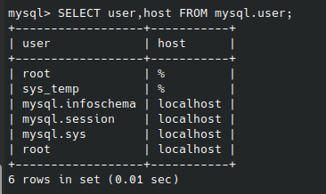
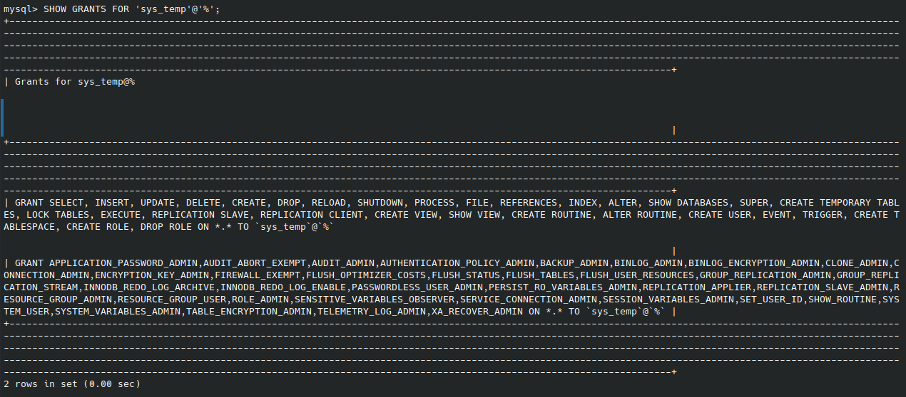
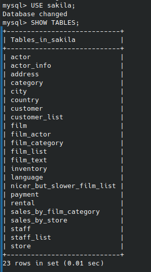

# Домашнее задание к занятию "`GitLab`" - `Болтунов Алексей`

### Инструкция по выполнению домашнего задания

   1. Сделайте `fork` данного репозитория к себе в Github и переименуйте его по названию или номеру занятия, например, https://github.com/имя-вашего-репозитория/git-hw или  https://github.com/имя-вашего-репозитория/7-1-ansible-hw).
   2. Выполните клонирование данного репозитория к себе на ПК с помощью команды `git clone`.
   3. Выполните домашнее задание и заполните у себя локально этот файл README.md:
      - впишите вверху название занятия и вашу фамилию и имя
      - в каждом задании добавьте решение в требуемом виде (текст/код/скриншоты/ссылка)
      - для корректного добавления скриншотов воспользуйтесь [инструкцией "Как вставить скриншот в шаблон с решением](https://github.com/netology-code/sys-pattern-homework/blob/main/screen-instruction.md)
      - при оформлении используйте возможности языка разметки md (коротко об этом можно посмотреть в [инструкции  по MarkDown](https://github.com/netology-code/sys-pattern-homework/blob/main/md-instruction.md))
   4. После завершения работы над домашним заданием сделайте коммит (`git commit -m "comment"`) и отправьте его на Github (`git push origin`);
   5. Для проверки домашнего задания преподавателем в личном кабинете прикрепите и отправьте ссылку на решение в виде md-файла в вашем Github.
   6. Любые вопросы по выполнению заданий спрашивайте в чате учебной группы и/или в разделе “Вопросы по заданию” в личном кабинете.
   
Желаем успехов в выполнении домашнего задания!
   
### Дополнительные материалы, которые могут быть полезны для выполнения задания

1. [Руководство по оформлению Markdown файлов](https://gist.github.com/Jekins/2bf2d0638163f1294637#Code)

---

### Задание 1

`Приведите ответ в свободной форме........

---
Список пользователей БД

Список прав пользователя sys_temp 
 
Список таблиц БД 

Список запросов

### Задание 2 

---

  

Обоснование: 
Лендинги требуют быстрой записи и простой структуры, часто с изменяющимися форматами данных (например, разные формы сбора лидов). NoSQL позволяет быстро масштабироваться и адаптироваться к изменениям. 

CRM требует как гибкости (хранение разнородной информации о клиентах), так и связи между объектами (например, клиент – сделка – комментарии), что хорошо покрывается реляционными возможностями. 

Примеры реализации:    

    MongoDB / Couchbase для лендингов  
    PostgreSQL (с JSON-полями) для CRM
     

 
1.2 Можно ли использовать одну СУБД? * 

Да - PostgreSQL  

Обоснование: 
PostgreSQL поддерживает: 

    JSONB для гибкого хранения данных с высокой производительностью
    ACID-транзакции
    Поддержку сложных схем и связей
    Расширяемость и богатые механизмы безопасности
     

Это делает её универсальным решением для одновременной работы с CRM и лендингами. 
 
1.3. База знаний отдела контроля качества  

Рекомендуемый тип СУБД: 
Реляционная или документо-ориентированная  

Обоснование: 
Требуется простая и понятная структура, возможно иерархическая организация (например, разделы → подразделы → статьи). Это можно реализовать как через реляционную модель, так и через документоориентированную. 

Примеры реализации:    

    PostgreSQL (с JSONB)  
    MongoDB (если важна гибкость структуры документов)
     

 
1.3 . Использовать существующую СУБД? * 

Да, можно.  

Интегрировать в уже выбранную PostgreSQ , если она используется в других задачах.
Можно создать отдельную схему или таблицы для хранения нормативных документов, с возможностью полнотекстового поиска и версионности. 
 
1.4. Логистика: маршруты доставки и распределение курьеров  

Тип СУБД: 
Графовая (Graph Database)  

Обоснование: 
Задачи логистики связаны с анализом связей: точки, маршруты, транспорт, люди. Графовые СУБД оптимизированы для работы с такими данными и позволяют быстро находить кратчайшие пути, рассчитывать нагрузку, моделировать сети. 

Примеры реализации:    

    Neo4j  
    Amazon Neptune  
    ArangoDB
     
 
1.4 Интеграция с отделом закупок * 

Возможные варианты:  

    Интеграция в ту же графовую СУБД: 
    Если данные о поставщиках, товарах и маршрутах взаимосвязаны, то графовая модель будет эффективной для объединения логистики и закупок. 

    Создание отдельной СУБД с интеграцией: 
    Если закупки требуют более традиционного подхода (например, работа с номенклатурой, договорами, ценами), можно использовать реляционную СУБД и интегрировать её с графовой через API или ETL. 
     

 
1.5 Можно ли всё сделать в одной СУБД? * 

Возможно выбрав PostgreSQL  

PostgreSQL — одна из самых мощных и гибких СУБД, поддерживающая: 

    Реляционные данные (финансы, CRM)
    JSONB для гибких структур (лендинги, документы)
    Графовые расширения (через Apache AGE или вручную через рекурсивные запросы)
    Полноценный OLAP (аналитика)
    Расширяемость (можно добавлять full-text search, GIS-данные и др.)
     

Недостатки такого подхода:  

    Меньшая производительность по сравнению со специализированными СУБД (например, Neo4j для графов)
    Сложность поддержки единой системы на всех уровнях бизнеса
    Потенциальные проблемы масштабируемости и отказоустойчивости

---

### Задание 2

`Приведите ответ в свободной форме........`
2.1. Пользователь пополняет баланс счёта телефона  

Чтобы транзакция завершилась успешно, нужно выполнить несколько действий в строгом порядке и с соблюдением ACID-свойств :
A tomacity (атомарность), C onsistency (согласованность), I solation (изолированность), D urability (долговечность). 
     Шесть шагов успешной транзакции: 

    Проверка реквизитов пользователя и номера телефона 
    Система проверяет, что пользователь авторизован, и указанный номер принадлежит ему или указан корректно. 

    Запрос на списание средств с платёжного инструмента (карты, кошелька) 
    Инициируется транзакция на определённую сумму от платёжной системы (например, банк блокирует сумму на карте). 

    Блокировка суммы во временном состоянии (в рамках транзакции) 
    В системе создаётся временная запись о том, что деньги выделены под операцию пополнения, но ещё не зачислены. 

    Уведомление оператора связи для пополнения баланса 
    Сервис отправляет запрос провайдеру (например, через API) о зачислении указанной суммы на телефонный номер. 

    Подтверждение успешного зачисления от оператора связи 
    Получено положительное подтверждение от оператора — средства успешно зачислены на телефонный счёт. 

    Фиксация транзакции: списание средств и обновление истории 
    Финальная фиксация транзакции в БД: 
        Списание денег с платёжного инструмента
        Обновление истории транзакций
        Подтверждение пользователю
         
     

Если хотя бы один из этих этапов завершается неудачей — транзакция откатывается (rollback) , чтобы сохранить целостность данных. 
 
2.1 Автоплатёж * 

Если пополнение происходит через автоплатёж, логика немного меняется. Основные отличия: 

    Пользователь заранее даёт согласие на регулярные списания.
    Платёж может быть инициирован автоматически без участия пользователя.
    Может использоваться сохранённый платёжный метод (карта, например).
     

     Изменения в шагах: 

    Проверка условий автоплатежа и расписания 
    Система проверяет, наступил ли срок следующего платежа и какие условия были установлены (сумма, периодичность). 

    Автоматическое списание средств с сохранённого платёжного инструмента 
    Нет необходимости в ручном подтверждении — система сама инициирует транзакцию. 

    (То же, что и выше) Блокировка суммы во временном состоянии  

    (То же) Уведомление оператора связи  

    (То же) Подтверждение от оператора  

    Фиксация транзакции + уведомление пользователю 
    После успешного зачисления пользователь получает уведомление о проведённом автоплатеже. 
     
---

### Задание 3

`Приведите ответ в свободной форме........`

## **3.1. Пять преимуществ SQL-систем по отношению к NoSQL**

SQL-системы обладают рядом важных преимуществ перед NoSQL, особенно когда речь идёт о надёжности, структурированности и аналитике данных:

1. **Строгая типизация и схема данных**  
   В SQL-системах данные хранятся в заранее определённых таблицах с чётко заданными типами полей. Это позволяет избежать ошибок при записи и чтении информации, обеспечивает целостность и упрощает поддержку логики бизнес-процессов.

2. **Поддержка ACID-транзакций «из коробки»**  
   SQL-СУБД изначально ориентированы на транзакционную обработку, что делает их идеальным выбором для систем, где критически важно не потерять данные или допустить промежуточные некорректные состояния — например, банковские системы, платформы электронной коммерции.

3. **Механизмы связи между данными через JOIN**  
   Возможность объединять данные из разных таблиц с помощью JOIN-запросов даёт мощный инструмент для работы с взаимосвязанными данными. Это удобно при построении сложных отчётов, аналитики и связывании объектов вроде пользователей, заказов, товаров.

4. **Развитые средства аналитической обработки (OLAP)**  
   SQL-СУБД поддерживают продвинутые функции: агрегатные вычисления, оконные функции, подзапросы и CTE. Это позволяет строить сложные аналитические отчёты без необходимости использования сторонних систем.

5. **Зрелая экосистема и большое количество готовых решений**  
   У SQL-систем сложились стандарты, вокруг них построены десятки инструментов: ORM, ETL, BI-панели, системы мониторинга и репликации. Это делает их легко интегрируемыми и удобными для разработки и эксплуатации.

---

## **3.1*. Преимущества NewSQL перед SQL и NoSQL**

NewSQL представляет собой гибридный класс СУБД, сочетающий лучшие черты традиционных SQL-систем и современных NoSQL-решений.

### Основные преимущества NewSQL:

- **Горизонтальная масштабируемость как у NoSQL**  
  В отличие от большинства классических SQL-СУБД, NewSQL может эффективно масштабироваться за счёт добавления новых серверов, сохраняя при этом согласованность данных и высокую производительность.

- **Полная поддержка ACID-транзакций в распределённой среде**  
  Это ключевое преимущество: NewSQL сочетает надёжность SQL-транзакций с возможностью работать в распределённых системах, что особенно ценно для облачных сервисов и масштабируемых приложений.

- **Высокая производительность при больших нагрузках**  
  NewSQL-СУБД оптимизированы для работы с OLTP-нагрузкой — то есть большим количеством операций чтения и записи в секунду — без потери согласованности и скорости.

- **Автоматическое управление шардингом и репликацией**  
  Современные NewSQL-системы умеют автоматически распределять данные между узлами, балансировать нагрузку и обеспечивать отказоустойчивость, что значительно снижает трудозатраты на администрирование.

- **Полная совместимость с SQL**  
  Для разработчиков и аналитиков остаются привычные механизмы работы: язык SQL, интеграция с BI-системами, ORM, ETL-процессы. Это делает переход на NewSQL более простым по сравнению с NoSQL.

---

Таким образом, **NewSQL** становится хорошим выбором для проектов, которым нужны одновременно:
- Высокая производительность и масштабируемость,
- Поддержка транзакций,
- Простота управления,
- Знакомый интерфейс SQL.

Примеры таких СУБД: **CockroachDB**, **TiDB**, **YugabyteDB**, **Google Spanner** и другие.

### Задание 4

`Приведите ответ в свободной форме........`
Для выполнения **большого количества вычислений на огромных объёмах данных** с использованием **1000 машин**, выбор типа СУБД и модели распределённых вычислений зависит от ключевого критерия:

---

### **Ключевой критерий: характер задачи — OLAP или OLTP**

#### 1. **Если задача — аналитическая (OLAP)**  
То есть требуется обработка больших объёмов данных, построение агрегатов, сложные запросы, массовые операции чтения и анализа...

Тогда лучший выбор:
- **Распределённая column-oriented СУБД** (например, **ClickHouse**, **Apache Parquet + Presto/Trino**, **BigQuery**, **Snowflake**)  
- Или **системы для big data вроде Apache Spark, Hadoop, Flink**

#### Почему:
- Такие системы оптимизированы под работу с большими данными.
- Они эффективно распределяют вычисления между тысячами узлов.
- Поддерживают горизонтальное масштабирование: чем больше машин — тем быстрее обрабатывается задача.

Модель распределённых вычислений: **MapReduce** или её современные аналоги — **Spark RDD/DAG**, **Flink Streaming**, **ClickHouse Distributed Engine**

---

#### 2. **Если задача — транзакционная (OLTP)**  
То есть нужно обрабатывать большое количество мелких операций (например, транзакции пользователей), где важны согласованность и целостность...

Тогда можно рассмотреть:
- **NewSQL СУБД**, например **CockroachDB**, **YugabyteDB**, **TiDB**

#### Почему:
- NewSQL сочетает ACID-гарантии SQL с возможностью горизонтального масштабирования.
- Позволяет работать с транзакциями в распределённой среде.
- Обеспечивает отказоустойчивость и автоматическое управление шардингом и репликацией.

Модель распределённых вычислений: **распределённые транзакции с шардингом и логическим разделением данных по узлам**

---

## Лучшая модель распределённых вычислений при условии, что задача — аналитическая

> **Выбор: модель MapReduce или её современные реализации, такие как Apache Spark или ClickHouse**

### Почему именно они?

- **Горизонтальное масштабирование**: легко использовать сотни и тысячи машин.
- **Распределённая обработка**: данные разбиваются на фрагменты и обрабатываются параллельно.
- **Оптимизация под большие данные**: особенно если используется columnar storage (как в ClickHouse).
- **Поддержка сложных вычислений**: Spark, например, позволяет писать сложную логику на Python, Java, Scala.
- **Отказоустойчивость**: если один узел выходит из строя, задача продолжается на других.

---

## Вывод

При наличии **1000 машин** и необходимости выполнять **много вычислений над огромным объёмом данных**, выбор СУБД и модели распределённых вычислений должен основываться на **характере нагрузки**:

- Если это **OLAP (аналитика)**  можно использовать **распределённые columnar СУБД** или **big data платформы вроде Spark**
- Если это **OLTP (транзакции)** можно рассмотреть **NewSQL**

Лучшей моделью распределённых вычислений в условиях масштабной аналитики остаётся **MapReduce или её современные аналоги вроде Apache Spark** благодаря их гибкости, производительности и способности задействовать все доступные машины.
